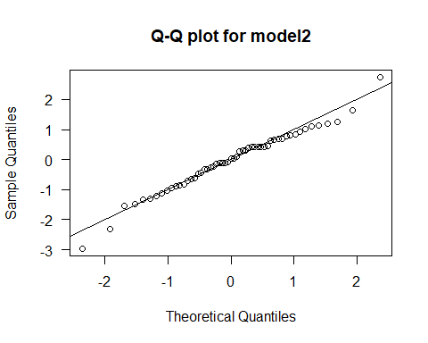

# GLM_belection

## 目錄
- [簡介](#簡介)
- [敘述統計](#敘述統計)
- [模型選擇](#模型選擇)
  - [model 1](#model-1)
  - [model 2](#model-2)
  - [model 比較與 ANOVA](#model比較與ANOVA)
- [模型選擇結果與殘差分析](#模型選擇結果與殘差分析)
- [模型公式與變數解釋](#模型公式與變數解釋)
  - [勝算比（Odds Ratio）解釋](#勝算比odds-ratio解釋)

## 簡介
使用 R 語言與 GLM 模型，分析不同政黨提名女性候選人之比例差異，並評估地區是否影響性別比例。

## 敘述統計

從各政黨的女性候選人比例boxplot圖中可以看出，Green政黨的女性候選人比例明顯高於其他政黨，其中位數約為0.27，顯示該政黨在性別平衡方面表現較佳。然而，Green政黨在不同地區的女性比例也呈現出最大的離散程度，且出現離群值，代表在各地區之間的性別比例差異較大。相較之下，Conservative的女性候選人比例不僅中位數最低，約為0.06，整體分布也較為集中，表示該政黨在多數地區的女性候選人比例普遍偏低。另外，Labour、LibDem以及其他政黨，其女性候選人比例的中位數與四分位距相近，反映這些政黨在整體性別比例上有類似的分布趨勢。

從各地區女性候選人比例的boxplot圖中可觀察到，GreaterLondon、SouthEast與SouthWest地區的中位數相對較高，約落在0.25左右。其中，SouthEast的四分位距最為狹窄，反映該地區各政黨之間女性候選人比例的變異較小。相較之下，Wales地區的中位數最低，約為0.11，且出現比例為0的極端值，顯示有政黨在該地區未提名任何女性候選人。EastAnglia的盒狀圖沒有上下延伸線，可能因樣本數較少，但可見兩端的離群值，代表該地區存在極高與極低比例的情況。其餘地區的中位數與四分位距相近，意味著這些地區女性候選人比例的整體趨勢較為一致。

## 模型選擇
### model 1
| 變數       | 估計值 (Estimate) | 標準誤 (Std. Error) | z 值 (z value) | p 值 (Pr > \|z\|) | 顯著性    |
| ----------- | -------------- | ---------------- | ----- | ------------ | ------ |
| (Intercept) | -2.16          | 0.28             | -7.69 | 1.5e-14      | \*\*\* |
| PartyGreen  | +1.11          | 0.20             | 5.47  | 4.5e-08      | \*\*\* |
| PartyLabour | +0.92          | 0.17             | 5.40  | 6.8e-08      | \*\*\* |
| PartyLibDem | +1.02          | 0.17             | 6.04  | 1.5e-09      | \*\*\* |
| PartyOther  | +0.91          | 0.17             | 5.35  | 8.9e-08      | \*\*\* |
| Region（全部）  | -0.48 \~ +0.03 | ≈0.27\~0.33      | ≈±0.8 | ≧ 0.14\~0.99 | ❌ 無顯著性 |

### model 2
| 變數       | 估計值 (Estimate) | 標準誤 (Std. Error) | z 值 (z value) | p 值 (Pr > \|z\|) | 顯著性    |
| ----------- | -------------- | ---------------- | ------------- | ---------------- | ------ |
| (Intercept) | -2.31       | 0.14           | -16.67       | < 2e-16          | \*\*\* |
| PartyGreen  | +1.15        | 0.20           | 5.68         | 1.37e-08         | \*\*\* |
| PartyLabour | +0.92        | 0.17           | 5.39         | 7.08e-08         | \*\*\* |
| PartyLibDem | +1.02        | 0.17           | 6.03         | 1.62e-09         | \*\*\* |
| PartyOther  | +0.92        | 0.17           | 5.43         | 5.54e-08         | \*\*\* |

### model 比較與 ANOVA
| 模型名稱   | 模型使用變數            | AIC        | Residual Deviance | 自由度 |p 值     |
| ------ | -------------- | ---------- | ----------------- | --- |-|
| model1 | Party + Region | 275.03     | 51.25             | 41  |-|
| model2 | Party          | **266.61** | 60.82             | 50  |-|
| ANOVA  | (model1 vs model2) | -          | -           | 9  | 0.386 ❌ |

根據係數的顯著性來看，所有Region變數的p值皆大於0.05，顯示Region在模型中並不具顯著的解釋力。因此，僅包含Party的模型(model2)相較於同時考慮Party與Region的完整模型(model1)，更為簡潔且有效。此外，model2的AIC(266.6078)亦低於model1(275.0311)，表示model2整體擬合效果更佳。雖然model1的residual deviance較小，但因為它使用更多變數、自由度較少，實際上的改善有限。從ANOVA檢定結果可知，加入Region後，並未顯著提升模型表現，其p值為0.3858，大於0.05，意味著Region在統計上並未提供額外的解釋力，故model2是更合適的GLM模型。

## 模型選擇結果與殘差分析

由Q-Q圖可知，大部分點落在對角線附近，顯示model2的殘差大致符合常態分布，不過在分布的兩端，仍可觀察到少數點明顯偏離直線，反映出殘差可能存在離群值。

殘差圖中未見明顯的系統性趨勢，表示殘差呈隨機分布，擬合線大致沿著零軸，支持模型的變異數為常數的假設。

## 模型公式與變數解釋

使用 binomial GLM 建構女性候選人比例模型：

logit(μ) = log(μ / (1 − μ))  
         = −2.3148 + 1.1516×x₁ + 0.9206×x₂ + 1.0209×x₃ + 0.9174×x₄

其中：
- μ：女性候選人比例（Females / Total）
- x₁ ~ x₄：政黨 dummy variables，分別為 Green、Labour、LibDem、Other（若屬該黨則為1）
- 參考組別：Conservative（即 x₁ ~ x₄ 全為 0 時的 baseline）

### 勝算比（Odds Ratio）解釋

| 政黨（vs Conservative） | 係數  | 勝算比  | 解釋                             |
| ------------------- | ----------- | ------------------- | ------------------------------ |
| Green               | 1.1516      | ≈ **3.16**          | 提名女性的勝算為 Conservative 的 3.16 倍 |
| Labour              | 0.9206      | ≈ **2.51**          | 提名女性的勝算為 Conservative 的 2.51 倍 |
| LibDem              | 1.0209      | ≈ **2.78**          | 提名女性的勝算為 Conservative 的 2.78 倍 |
| Other               | 0.9174      | ≈ **2.50**          | 提名女性的勝算為 Conservative 的 2.50 倍 |

上述結果顯示，相較於Conservative，其他政黨提名女性候選人的機率較高，尤其是Green與LibDem黨派，對女性候選人有明顯較高的支持度。
